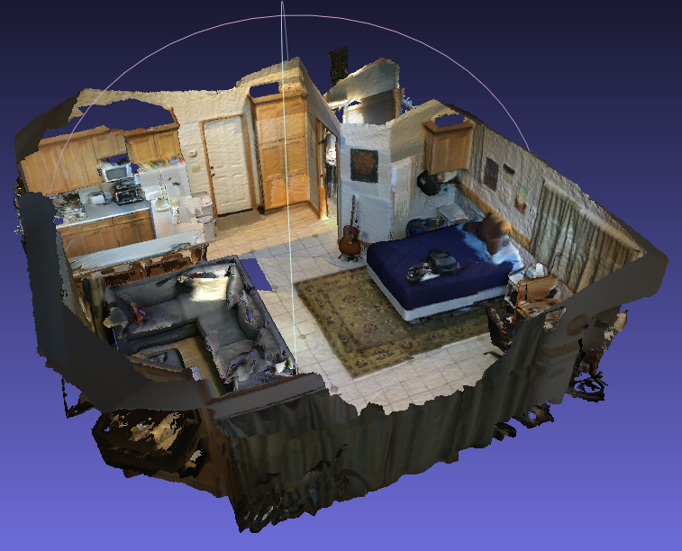

# Clearance vectors calculator 
Train, visualize and configure to test on environments, the interaction between entities.

## 08_1_testing_env_single_it.py
Testing on an evinronment with 28401 Points
Poisson sampling by minimum distance (5 cm)
    
    Execution time:  27.464157342910767

Poisson sampling by number of samples
 
    Execution time:  57.911153078079224

Testing environment execution time:  4284 sec. = 71.4 min

